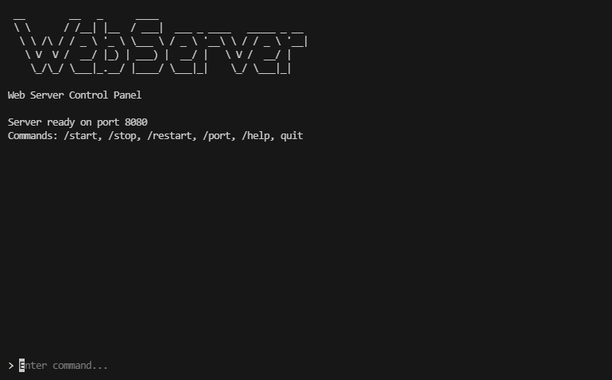
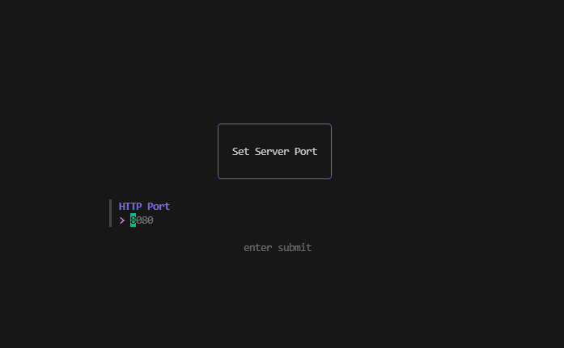

# BubbleWebServer

Go TUI + simple HTTP server packaged as an importable module.

This repository exposes a `bubbleserver` package that provides a BubbleTea-based TUI to manage a small HTTP server and register routes.

## Quick start

1. Ensure Go is installed (Go 1.25+ recommended).
2. Get the package (replace username if you host under a different account):

   ```bash
   # install the bubbleserver package
   go get github.com/efrai/BubbleWebServer/bubbleserver
   ```

3. See `example_main.go` for a full usage example. Example imports:

   ```go
   import "github.com/efrai/BubbleWebServer/bubbleserver"
   ```

## Running locally

- For quick testing run `go run main.go` from the repo root. This runs the local TUI + bundled webserver.
- Default webserver port is 8090; use `/set port` in the TUI or call `server.SetDefaultPort(...)` in code.

## Screenshots

TUI main screen:



Port selection form:



